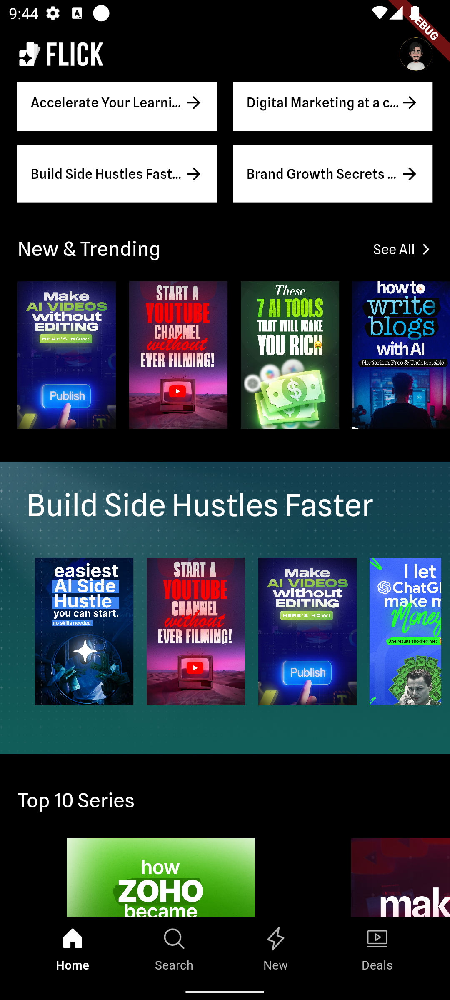

# Hi there, I'm Sandeep 👋

**Flutter & Android Developer | Firebase Expert | Backend Developer (Next.js, PostgreSQL, MongoDB)**

I'm a seasoned developer with 10+ years of experience delivering robust, scalable apps across mobile and web. My focus is on creating seamless cross-platform solutions using Flutter and Firebase, backed by real-time data and clean architecture. I build with performance, reliability, and user experience in mind.

## 🚀 Tech Stack
**Languages & Frameworks:** Flutter, Dart, Java, Kotlin, Node.js, Next.js  
**Databases:** Firebase, PostgreSQL, MongoDB  
**State Management:** BLoC, GetX, MVVM, Provider  
**Tools & Integrations:** Mixpanel, Segment.io, Razorpay, RevenueCat, OTPless, Crashlytics, WebEngage, FCM  
**Deployment:** Heroku, Vercel, GitHub Actions, Firebase Hosting

## 🌟 Featured Projects

### 📘 [Jazzee Attendance](https://apps.apple.com/us/app/jazzee-faculty/id6742661280)  
A smart attendance app for educators using Firebase, Bluetooth, and Excel-based analytics. Designed to prevent proxy and automate reports.  
[Google Play](https://play.google.com/store/apps/details?id=jazzee.edtech.faculty) | [App Store](https://apps.apple.com/us/app/jazzee-faculty/id6742661280)

### 🎓 [OutSkill by GrowthSchool](https://apps.apple.com/in/app/growthschool-online-courses/id6451403519)  
A microlearning app featuring Mixpanel, WebEngage, and REST APIs. I led the mobile team, implemented BLoC architecture, and deployed it to production.  
[Google Play](https://play.google.com/store/apps/details?id=io.growthschool) | [App Store](https://apps.apple.com/in/app/growthschool-online-courses/id6451403519) | [Website](https://growthschool.io/)

### 🎥 [Flick](https://apps.apple.com/in/app/flick-learning-app/id6740239655)  
A fast-paced learning app using OTPless login and Razorpay. Focused on delivering 1-minute video reels with clean UI from Figma designs.  
[App Store](https://apps.apple.com/in/app/flick-learning-app/id6740239655)

### 🎬 [Plan Your Shoot](http://www.planyourshoot.com)  
A community platform for filmmakers with real-time Firebase chat and RxDart integration. Built from scratch including backend setup.  

## 🌱 Currently Open To
- Freelance Flutter & Backend Projects
- AI-Integrated App Development
- Firebase Migrations, Performance Tuning

## 📄 Explore My Developer Profile

📝 [My Dev Career](https://docs.google.com/document/d/e/2PACX-1vRwLjbwttFi2EZxsxpRZyJ93tBeSvmT8zFG93AeEnXS7z5pV0qpWu5QhN8f90-60DmOM3keXiLgLT7h/pub)

✍️ [Medium](https://medium.com/@SandeepGurram)

## 📫 Connect with Me
📧 sandeepgurram810@gmail.com  
💬 [Chat on WhatsApp](https://wa.me/919000324143)  
🔗 [linkedin.com/in/sandeepgurram](https://linkedin.com/in/sandeepgurram)

